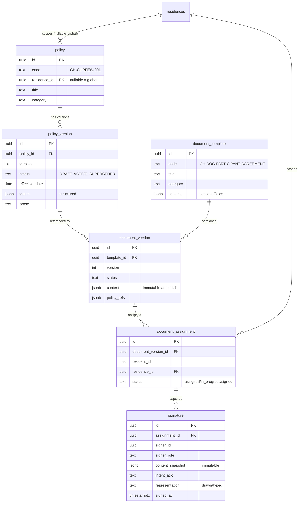

# Grace House VRCC — Build-Out Plan & Ground Truth

**Status:** Foundation phase. This document is the authoritative map for the Grace House
build. It records the live-verified inventory, the reuse map, the gap analysis, the
sequenced plan, and the open Decision Register. It supersedes assumptions in legacy
material; the live database is the source of truth.

**Target project (Supabase):** `ykykeioydvtxpyreshhs` — ⚠️ this is the **live production**
DB serving real VRCC participants. New schema is developed/tested on a Supabase
**development branch** and merged; never iterated directly on prod.

---

## 1. Canonical Truth Register (locked)

Every document, form, screen, record, and validation rule consumes these. Conflicting
legacy values are superseded.

| Fact | Canonical value |
|---|---|
| Residence | Grace House |
| Operator | Grace For Addictions, 501(c)(3) |
| Address | 1311 9th Street, Des Moines, Iowa 50314 |
| Population | Women-focused recovery residence |
| Model | Peer-led, non-clinical, NARR Level II / Type M aligned |
| Certification | "**Preparing for** NARR Level II certification" — never "certified" |
| Occupancy language | Participant / resident — never "tenant" |
| MOUD/MAT | Fully affirming; never a violation, never a positive screen, never reduces privileges |
| Return-to-use | Supportive re-engagement; never automatic discharge; the word "relapse" is prohibited in output |
| Language | Person-first, trauma-informed; never "addict/clean/dirty/offender" (except a quoted legal title) |
| Contact | Office 515-220-8771 · gracehouse@graceforaddictions.org · Warmline 515-310-DIAL (3425) |
| Fees (GH-FEES-001) | Double/shared $175/wk or $650/mo prepaid-in-full · Single/private $200/wk or $700/mo prepaid-in-full |
| Curfew (GH-CURFEW-001 v2.0) | Phase 1: 9pm/10pm · Phase 2: 10pm/11pm · Phase 3: 11pm/12am. **Hard ceiling: never past midnight.** Quiet hours start at curfew, end 7am. |

---

## 2. Live inventory (verified `ykykeioydvtxpyreshhs`, this session)

### 2.1 Residence backend — EXISTS in `gfa_residence` (RLS on; scaffolded, ~empty)
`residences`(3) · `beds`(17) · `waitlist`(0) · `fee_ledger`(0) · `drug_tests`(0) ·
`incidents`(0) · `discharges`(0) · `phase_history`(0) · `chore_assignments`(0) ·
`house_meetings`(0) · `narr_compliance`(0) · `iowa_hhs_checklist`(0) ·
`supervision_reports`(0) · `providers`(1) · `provider_members`(0) ·
`residence_availability` · `public_profiles`(2).

Key columns confirmed:
- `residences`: narr_level, **narr_cert_status/date/expiry**, shared_room_fee, private_room_fee,
  accepts_mat, accepts_supervision, reentry_focus, faith_requirement, contact_phone, warmline,
  contact_email, min_stay, avg_stay, priority_population, public_listed, active.
- `beds`: residence_id, label, room_type, status, resident_id, occupied_since.
- `fee_ledger`: entry_type, amount, description, due_date, paid_date, method, receipt_no.
- `drug_tests`: test_date, method, result, substances(jsonb), administered_by. *(MOUD-never-positive is a logic rule.)*
- `incidents`: **level int (1–4)**, incident_type, description, action_taken, status, occurred_at, reported_by.
- `discharges`: discharge_type, reason, resources_provided(jsonb), length_of_stay_days.
- `phase_history`: from_phase, to_phase, effective_date, milestone_note.
- `narr_compliance`: standard_code, domain, requirement, status, evidence_source/url, last_verified, next_review.
- `supervision_reports`: referral_partner, period_start/end, payload(jsonb), status, generated_at.

### 2.2 Identity & roles — EXISTS
- Identity: `gfa_identity.participant_crosswalk`, `gfa_ui.participant_profiles`,
  `public.participant_profiles`, `gfa_ui.residents`.
- Roles: `public.app_users.role`; helpers `public.get_my_role()`, `my_role()`,
  `get_vrcc_user_role()`, `is_admin()`, `is_coach()`, `gfa_core.is_staff()`,
  `my_assigned_participant_ids()`, `gfa_ui.my_participant_id()`, `admin_set_role()`,
  `public.role_preassignments`.

### 2.3 Consent — EXISTS (partial)
`gfa_ui.consent_records`, `gfa_ui.consent_tokens`, `gfa_core.lkp_consent_method`.

### 2.4 Frontend — the launched VRCC app is a DIFFERENT stack/model
`main`/`vrcc-refine` = React 18 + JS (not TS) + Vite + plain CSS (no Tailwind) + no router,
on `public.participants`/`mvp_*`. It is NOT the `gfa_residence` model. The Grace House
portals are therefore a **new application surface**, and the directive's mandated stack
(React 19 + TS + Tailwind + React Router) differs from what exists. **See Decision GH-D100.**

---

## 3. Reuse map & gap analysis

| Section 4 module | Reuse (exists) | Build (new) |
|---|---|---|
| Policy engine (3.1) | — | `policy`, `policy_version` (+ consistency validator) |
| Bed/waitlist | `beds`, `waitlist` | admission linkage to documents |
| Fees | `fee_ledger`, residence fee cols | deposit/refund fields (GH-D004 placeholder) |
| Drug screening | `drug_tests` | phased-frequency scheduler; MOUD-never-positive rule |
| Incidents | `incidents` (levels 1–4) | timing SLAs; emergency-removal workflow + legal watermark (GH-D015) |
| Discharge | `discharges` | 2h/48h protocol; grievance notice |
| Phase/curfew | `phase_history` | curfew/pass logic driven by policy engine |
| Compliance | `narr_compliance`, `iowa_hhs_checklist` | readiness dashboard; binder export; cert-by-external-decision |
| Justice partner | `supervision_reports`, `providers` | ROI-gated report generator; agency log (GH-D013) |
| Documents & signatures | `gfa_ui.consent_records` (partial) | `document_template`, `document_version`, `document_assignment`, `signature` (immutable snapshot + intent-to-sign) |
| Roles/RLS | role helpers | extend role vocabulary to the 8 roles; residence-scoped RLS |
| Resident/Staff/Compliance/Justice portals | — | **entire frontend** |

---

## 4. Entity model — new tables (ERD)

Cross-doc consistency validator reads `policy_version.values` (curfew, fees, screening
frequency, visitor rules, contact) and fails any release where a rendered value diverges
or a curfew exceeds midnight.

---

## 5. Build sequence

1. **Policy engine** (`policy`, `policy_version`) + seed GH-CURFEW-001 v2.0, GH-FEES-001,
   GH-CONTACT-001. → `supabase/migrations/*_gracehouse_policy_engine.sql`
2. **Document & signature layer** (`document_template`, `document_version`,
   `document_assignment`, `signature`). → `*_gracehouse_documents_signatures.sql`
3. **Role vocabulary + residence-scoped RLS** for the 8 roles.
4. **Seed** residence config (Grace House canonical facts), NARR/Iowa checklists,
   document templates (from the corrected legacy suite).
5. **Frontend** (pending GH-D100): resident portal → staff portal → compliance engine →
   justice module.
6. **QA gates** (Section 5) — cross-doc audit, cert-language audit, curfew audit, signature
   integrity, RLS matrix, ROI gate, decision-register audit, language audit, a11y, build.

Each step is developed on a Supabase dev branch and merged; the frontend follows GH-D100.

---

## 6. Decision Register (do not fabricate — build around)

| ID | Item | Status / build instruction |
|---|---|---|
| GH-D003 | Verified bed capacity / room config (legacy "up to 10" unverified) | Beds are data; no capacity number in prose. `residences.total_beds` left null until verified. |
| GH-D004 | Deposit & refund policy (rates now canonical) | Fee amounts render from GH-FEES-001; deposit/refund ship as labeled placeholders; agreement refund language flagged for leadership. |
| GH-D013 | DOC/justice-partner reporting commitments | Build ROI + supervision report generator; gate all external transmission behind executed ROI. |
| GH-D015 | Iowa occupancy-status legal review of termination/removal | Termination/removal artifacts carry "LEGAL REVIEW REQUIRED — IOWA OCCUPANCY STATUS" watermark until cleared. |
| **GH-D100** (new) | **Frontend stack & location.** Directive mandates React 19 + TS + Tailwind + Router; the deployed VRCC app is React 18 + JS + plain CSS + no router on a different data model. | **Needs owner decision:** (a) new Grace House app in the mandated stack, or (b) extend the existing app. Backend/migrations proceed regardless. |
| **GH-D101** (new) | **Schema application target.** Prod is live with real participants. | **Recommendation:** apply/test new schema on a Supabase **development branch**, then merge. Awaiting go-ahead. |

---

## 7. Honesty statement

The residence backend is largely present and well-modeled; the new backend work (policy
engine, documents/signatures, role/RLS extension) is bounded and proceeding as reviewable
migrations. The **frontend is a large, multi-session effort** and a genuine stack decision
(GH-D100). This build will not be declared complete until every Section 5 gate passes —
and it is not complete now.
